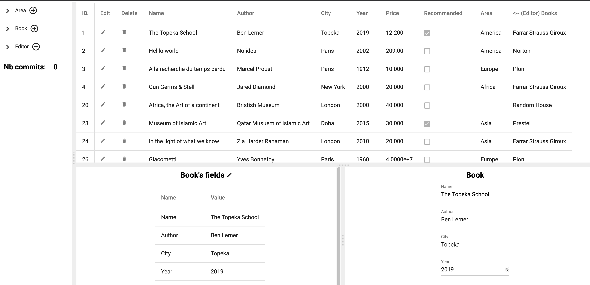

### Steps to have bookstore work:

1. Clone the repo
- > git clone github.com/fullstack-lang/helloworld

1. Install gongc (the gong compiler)
- > git clone github.com/fullstack-lang/gong
- > cd gong/go/gongc
- > go install
- > cd ../../..

3. Compile & run bookstore
- > cd bookstore/go/models; gongc

compilation should last less than a minute ("npm install" is the longuest operation)

Go back to the root directory of the bookstore repo
- > cd ../..

update the go needed modules 
- > go mod tidy

launch bookstore
- > go run main.go

```
bookstore % go run main.go
bookstore: Database Migration of package github.com/fullstack-lang/bookstore/go is OK
bookstore: Server ready serve on localhost:8080
```


1. Use bookstore
- launch browser on http://localhost:8080

### what you should see


